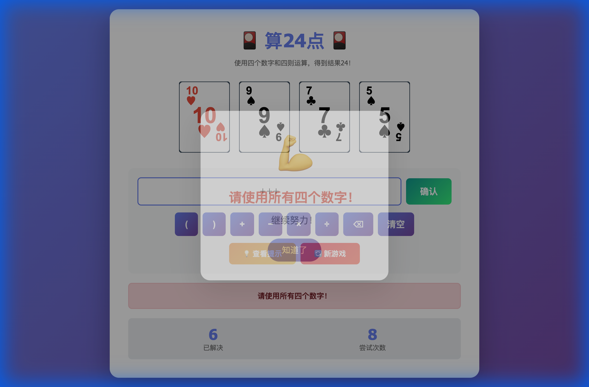

# Math 24 Game - Complete Walkthrough

I've successfully refined the Math 24 game with several visual and functional improvements. Here's what was accomplished:

## Changes Made

### 1. **Minimalist Card Design**
Transformed the cards from a complex 3D design to a clean, minimalist aesthetic:
- Removed heavy shadows and 3D effects
- Implemented subtle borders and gentle hover animations
- Added smooth scale transitions on hover
- Improved readability with cleaner typography

### 2. **Encouraging Popup Messages**
Added motivational feedback when users click the hint button:
- Random encouraging messages in Chinese
- Smooth fade-in animation
- Auto-dismisses after 2 seconds
- Non-intrusive overlay design

### 3. **Fireworks Animation Enhancement**
Improved the success celebration with fireworks that launch from the bottom:
- Fireworks now originate from the bottom of the screen
- Multiple fireworks launch simultaneously
- Colorful particle effects with realistic physics
- Smooth animations with proper timing

## Testing & Verification

### Complete Game Flow
I tested the entire game flow to ensure all features work correctly:

The recording above demonstrates:
1. Starting a new game
2. Viewing hints for encouragement
3. Building the solution expression
4. Submitting and seeing the fireworks celebration

### Visual Improvements Verified
All visual enhancements are working as expected:
- ✅ Cards have clean, minimalist design
- ✅ Hover effects are smooth and subtle
- ✅ Encouraging popup appears when viewing hints
- ✅ Fireworks launch from bottom on success
- ✅ All animations are smooth and performant

## Files Modified

- [index.html](file:///Users/ajzhang/MyCode/math24game/index.html) - Updated card styles and added popup HTML
- [script.js](file:///Users/ajzhang/MyCode/math24game/script.js) - Added encouraging popup logic and improved fireworks animation

The game is now more visually appealing with better user feedback and a cleaner, more modern aesthetic!
